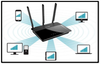

# **_Java Synchronization_**
A university assignment in which I simulate a limited number 
of devices connected to a router’s Wi-Fi using Java threading
 and semaphore 
## Problem Description:

It is required to simulate a limited number of devices
 connected to a router’s Wi-Fi using Java threading and 
 semaphore. Routers can be designed to limit the number 
 of open connections. 
 For example, a Router may wish to have only N connections 
 at any point in time. As soon as N connections are made, 
 the Router will not accept other incoming connection until 
 an existing connection is released. Explain how semaphores 
 can be used by a Router to limit the number of concurrent 
 connections.
 
 
 
 #### Consider the following rules:
 1. The Wi-Fi number of connected devices is initially empty.
 2. If a client is logged in (print a message that a client
  has logged in) and if it can be served 
  (means that it can reach the internet), then the client 
  should perform the following activities:
  
    1. Connect
    2. Perform online activity
    3. Log out.
    
    **Note: these actions will be represented by printed 
            messages, such that there is a random waiting time 
            between the printed messages when a client connects, 
            do some online activities and logged out.**
            
  3. If a client arrives and all connections are occupied,
   it must wait until one of the currently available clients
    finishes his service and leave.
  4. After a client finishes his service, he leaves and 
    one of the waiting clients (if exist) will connect 
    to the internet.
    
 #### Problem Design:
  The program contains the following classes:
  1. **Router Class**: that contains a list of connection and 
                        methods to occupy a connection and 
                        release a connection.
  2. **Semaphore Class**: for process cooperation and synchronization.
  3. **Device Class**: represent different devices (threads)
                   that can be connected to the router; 
                   each device has its own name (i.e. C1) and
                    type (i.e. mobile, pc, tablet...) and 
                    it may perform three activities: 
                    connect, perform online activity and disconnect/logout.
  4. **Network Class**: this class contains the main method in which
                    the user is asked for two inputs:
                    
                    1. N: max number of connections a router can accept.
                    2. TC: total number of devices that wishes to connect).
                    3. TC lines that contain: name of each device, and its type.
 
 #### Program Output
 The output logs are printed in a file, which simulates the execution order
  of the devices threads and the printed messages of each device.
  
 #### Example:
 _Sample Input:_
 ```
What is the number of WI-FI connections?
 2
 What is the number of devices clients want to connect?
 4
 C1 mobile
 C2 tablet
 C3 pc
 C4 pc

 ```

_Sample output_: (**Note: output depends on the order of the executions of the threads**)

```
- (C1) (mobile) arrived
- (C2) (tablet) arrived
- Connection 1: C1 occupied
- Connection 2: C2 occupied
- (C4) (PC) arrived and waiting
- (C3) (PC) arrived and waiting
- Connection 1: C1 performs online activity
- Connection 2: C2 performs online activity
- Connection 1: C1 logged out
- Connection 1: C4 occupied
- Connection 1: C4 performs online activity
- Connection 2: C2 logged out
- Connection 2: C3 occupied
```